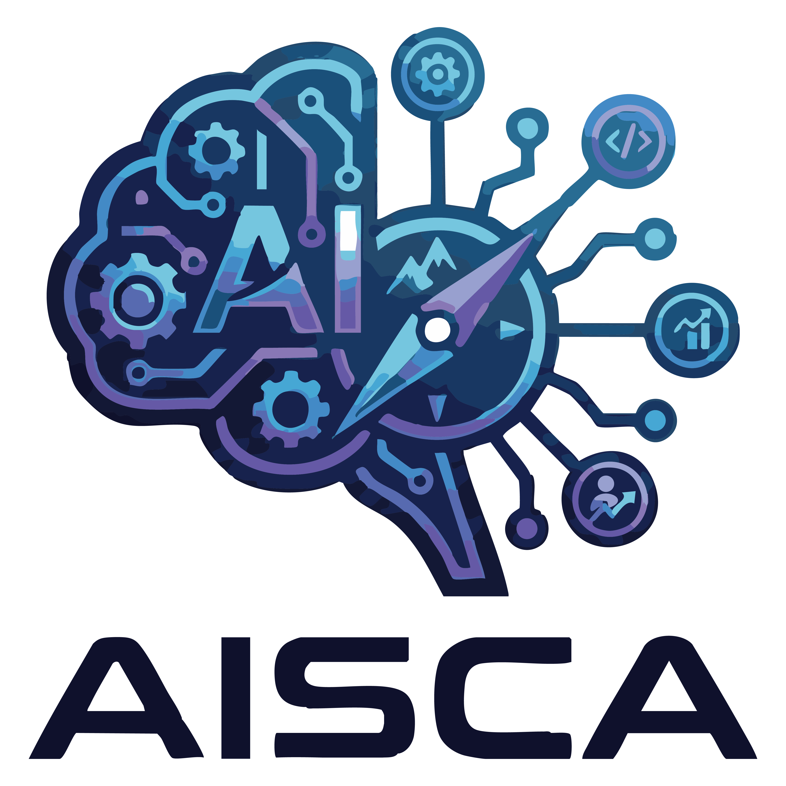

# 🧬 AISCA - Agent Intelligent Sémantique & Génératif



> **Cartographie des Compétences . Analyse RAG . Coaching IA**

**AISCA** (AI Skills & Career Agent) est une application intelligente d'orientation professionnelle pour l'écosystème Tech & Data. Elle combine **l'analyse sémantique locale** (SBERT) et **l'IA Générative** (Google Gemini) au sein d'une architecture **RAG** (Retrieval-Augmented Generation) pour matcher les profils aux opportunités réelles.

---

## 📋 Contexte

Projet réalisé dans le cadre de la certification **"Expert en Ingénierie de Données" (Bloc 2)**.
**Objectif :** Concevoir une solution "End-to-End" (Data Engineering + NLP + GenAI + UI) pour résoudre la problématique du matching sémantique de compétences.

## 🚀 Fonctionnalités Clés

* **🔍 Moteur Sémantique (NLP Local) :** Vectorisation SBERT et calcul de similarité cosinus (sans mot-clé exact).
* **🧠 Architecture RAG & GenAI :** Enrichissement des bios, traduction contextuelle et coaching personnalisé via Google Gemini.
* **🛡️ Filtrage Hybride :** Garde-fous logiques (Niveaux Maths/Code) pour éviter les hallucinations.
* **⚡ Performance :** Système de **Caching intelligent** (`history.csv`) et traitement In-Memory.
* **🐳 Conteneurisation :** Déploiement facilité via Docker.

## 📂 Structure du Projet

L'architecture respecte la séparation des responsabilités (ETL, Moteur NLP, Interface).

```bash
AISCA/
├── .streamlit/             # Configuration Streamlit
│   └── config.toml
├── data/
│   ├── raw_IT_jobs/        # Données brutes (CSV Kaggle)
│   │   └── IT_Job_Roles_Skills.csv
│   └── filtered_it_jobs.json  # Dataset nettoyé (Source de vérité de l'app)
├── logs/
│   └── history.csv         # Cache & Historique des requêtes
├── modules/                # Backend Logic
│   ├── __init__.py
│   ├── data_loader.py      # Pipeline ETL : Chargement & Nettoyage
│   ├── genai_engine.py     # Connecteur Gemini (RAG, Traduction)
│   └── nlp_engine.py       # Moteur Sémantique (SBERT, Scoring)
├── scripts/
│   └── generate_full_data.py # Script utilitaire de préparation des données
├── .dockerignore
├── .env                    # Variables d'environnement (API Key)
├── app.py                  # Point d'entrée (Frontend Streamlit)
├── docker-compose.yml      # Orchestration Docker
├── Dockerfile              # Image Docker
├── LOGO_AISCA.png          # Assets graphiques
├── readme.md               # Documentation
└── requirements.txt        # Dépendances Python
```

## ⚙️ Installation & Démarrage

### Option 1 : Installation Locale (Python)

**1. Cloner le projet :**

```bash
git clone [https://github.com/entiteco/Projet_IA_Gen_AISCA.git](https://github.com/entiteco/Projet_IA_Gen_AISCA.git)
cd AISCA
```

**2. Créer un environnement virtuel :**

```bash
python -m venv venv
source venv/bin/activate  # Mac/Linux
# ou
.\venv\Scripts\activate   # Windows
```

**3. Installer les dépendances :**

```bash
pip install -r requirements.txt
```

**4. Configuration API :** Renommez `.env.example` en `.env` (ou créez-le) et ajoutez votre clé :

```bash
GOOGLE_API_KEY="votre_cle_api_ici"
```

**5. Lancer l'application :**

```bash
streamlit run app.py
```

### Option 2 : Installation via Docker 🐳 (Recommandé)

Assurez-vous d'avoir Docker et Docker Compose installés.

**1. Configurer l'environnement :** Créez un fichier `.env` à la racine contenant :

```bash
GOOGLE_API_KEY=AIzaSyDxxxxxxxxx...
```

**2. Construire et lancer le conteneur :**

```bash
docker-compose up --build
```

**3. Accéder à l'application :** Ouvrez votre navigateur sur `http://localhost:8501`.

## 🧪 Scénarios de Tests (Quality Assurance)

Utilisez ces scénarios pour valider le comportement du moteur hybride.

#### Test 1 : Le "Perfect Match" (Validation Sémantique)

*Objectif : Vérifier que le moteur comprend le sens sans mots-clés exacts.*

* **Bio :** "Je conçois des réseaux de neurones profonds pour analyser des images médicales. Je maîtrise l'optimisation de modèles complexes."
* **Secteur Cible :** `Data Science`
* **Compétences (Select) :** `Deep Learning`, `Python`, `Computer Vision`
* **Niveaux :** Code `4/5` | Théorique `5/5`
* **Résultat Attendu :**
  * **Top Job :** *Computer Vision Engineer* ou  *Research Scientist* .
  * **Score :** > 85%.

#### Test 2 : Le Garde-Fou (Anti-Hallucination)

*Objectif : Vérifier que les règles métiers bloquent les profils techniquement faibles.*

* **Bio :** "J'adore l'intelligence artificielle, je lis beaucoup d'articles sur le sujet, c'est ma passion."
* **Secteur Cible :** `Peu importe`
* **Compétences (Select) :** (Laisser vide ou mettre juste `Excel`)
* **Niveaux :** Code `1/5` | Théorique `1/5`
* **Résultat Attendu :**
  * **Comportement :** Les métiers "Data Scientist" ou "ML Engineer" doivent être pénalisés ou disparaître du top 3 malgré la sémantique de la bio.
  * **Top Job :** *Data Analyst* (Junior) ou métiers moins techniques.

#### Test 3 : L'Augmentation GenAI (RAG)

*Objectif : Tester l'enrichissement automatique des inputs pauvres.*

* **Bio :** "Je fais du sql et des bases de données." (Moins de 5 mots).
* **Secteur Cible :** `Dev & Cloud`
* **Compétences (Select) :** `SQL`, `Database Management`
* **Niveaux :** Code `3/5` | Théorique `2/5`
* **Résultat Attendu :**
  * **Log (history.csv) :** Colonne `is_augmented` = `True`.
  * **Matching :** Pertinent (ex: *Database Administrator* ou  *Backend Developer* ) grâce à la réécriture par Gemini.

#### Test 4 : Le Cross-Domain & Traduction

*Objectif : Vérifier la gestion multilingue et l'ouverture sectorielle.*

* **Bio :** "J'ai géré des équipes de développeurs pendant 10 ans, je suis certifié Scrum Master et j'aime organiser les sprints."
* **Secteur Cible :** `Management`
* **Compétences (Select) :** `Agile Methodologies`, `Project Management`
* **Niveaux :** Code `2/5` | Théorique `2/5`
* **Résultat Attendu :**
  * **Top Job :** *Technical Project Manager* ou  *Scrum Master* .
  * **Interface :** Titre du poste traduit en FR (si Langue FR sélectionnée), mais conservation des termes techniques (ex: "Scrum Master").


---

# 🧬 AISCA - Intelligent Semantic & Generative Agent

> **Skills Mapping . RAG Analysis . AI Career Coaching**

**AISCA** (AI Skills & Career Agent) is an intelligent career guidance application designed for the Tech & Data ecosystem. It combines **local semantic analysis** (SBERT) and **Generative AI** (Google Gemini) within a **RAG** (Retrieval-Augmented Generation) architecture to accurately map candidate profiles to real-world job opportunities.


---

## 📋 Context

This project was developed as part of the  **"Data Engineering Expert" Certification (Block 2)** .
**Objective:** Design an "End-to-End" solution (Data Engineering + NLP + GenAI + UI) to solve the challenge of semantic skills matching.

## 🚀 Key Features

* **🔍 Semantic Engine (Local NLP):** SBERT vectorization and cosine similarity calculation (beyond exact keyword matching).
* **🧠 RAG & GenAI Architecture:** Bio augmentation, contextual translation, and personalized career coaching powered by Google Gemini.
* **🛡️ Hybrid Filtering:** Logical guardrails (Math/Code proficiency checks) to prevent hallucinated matches.
* **⚡ Performance:** Intelligent **Caching System** (`history.csv`) and In-Memory processing for low latency.
* **🐳 Containerization:** Seamless deployment via Docker.

## 📂 Project Structure

The architecture follows strict separation of concerns (ETL, NLP Engine, Frontend Interface).

```bash
AISCA/
├── .streamlit/             # Streamlit Configuration
│   └── config.toml
├── data/
│   ├── raw_IT_jobs/        # Raw Data (Kaggle CSV)
│   │   └── IT_Job_Roles_Skills.csv
│   └── filtered_it_jobs.json  # Cleaned Dataset (App Source of Truth)
├── logs/
│   └── history.csv         # Cache & Request History
├── modules/                # Backend Logic
│   ├── __init__.py
│   ├── data_loader.py      # ETL Pipeline: Loading & Cleaning
│   ├── genai_engine.py     # Gemini Connector (RAG, Translation)
│   └── nlp_engine.py       # Semantic Engine (SBERT, Scoring)
├── scripts/
│   └── generate_full_data.py # Data Preparation Utility Script
├── .dockerignore
├── .env                    # Environment Variables (API Key)
├── app.py                  # Entry Point (Frontend Streamlit)
├── docker-compose.yml      # Docker Orchestration
├── Dockerfile              # Docker Image Definition
├── LOGO_AISCA.png          # Graphic Assets
├── readme.md               # Documentation
└── requirements.txt        # Python Dependencies
```

---


### ⚙️ Installation & Setup

### Option 1: Local Installation (Python)

**1. Clone the repository:**

```bash
git clone [https://github.com/entiteco/Projet_IA_Gen_AISCA.git](https://github.com/entiteco/Projet_IA_Gen_AISCA.git)
cd AISCA
```

**2. Create a virtual environment:**

```bash
python -m venv venv
source venv/bin/activate  # Mac/Linux
# ou
.\venv\Scripts\activate   # Windows
```

**3. Install dependencies :**

```bash
pip install -r requirements.txt
```

**4. **API Configuration:**** Rename `.env.example` to `.env` (or create it) and add your key:

```bash
GOOGLE_API_KEY="your_api_key_here"
```

**5. Run the application:**

```bash
streamlit run app.py
```


### Option 2: Docker Installation 🐳 (Recommended)

Ensure you have Docker and Docker Compose installed.

**1. Configure environment:** Create a `.env` file at the root containing:

```bash
GOOGLE_API_KEY=AIzaSyDxxxxxxxxx...
```

**2. Build and run the container:**

```bash
docker-compose up --build
```

**3. **Access the app:** Open your browser at `http://localhost:8501`.**


---


## 🧪 Testing Scenarios (Quality Assurance)

Use these scenarios to validate the hybrid engine's behavior.

#### Test 1: The "Perfect Match" (Semantic Validation)

*Objective: Verify the engine understands meaning without exact keywords.*

* **Bio:** "Je conçois des réseaux de neurones profonds pour analyser des images médicales. Je maîtrise l'optimisation de modèles complexes."
* **Target Sector:** `Data Science`
* **Skills (Select):** `Deep Learning`, `Python`, `Computer Vision`
* **Levels:** Code `4/5` | Theory `5/5`
* **Expected Result:**
  * **Top Job:** *Computer Vision Engineer* or  *Research Scientist* .
  * **Score:** > 85%.

#### Test 2: The Guardrail (Anti-Hallucination)

*Objective: Verify business rules block technically weak profiles.*

* **Bio:** "J'adore l'intelligence artificielle, je lis beaucoup d'articles sur le sujet, c'est ma passion."
* **Target Sector:** `Peu importe` (Any)
* **Skills (Select):** (Leave empty or just `Excel`)
* **Levels:** Code `1/5` | Theory `1/5`
* **Expected Result:**
  * **Behavior:** High-tech roles like "Data Scientist" or "ML Engineer" must be penalized or removed from the top 3 despite semantic similarity.
  * **Top Job:** *Data Analyst* (Junior) or less technical roles.

#### Test 3: GenAI Augmentation (RAG)

*Objective: Test automatic enrichment of poor inputs.*

* **Bio:** "Je fais du sql et des bases de données." (Less than 5 words).
* **Target Sector:** `Dev & Cloud`
* **Skills (Select):** `SQL`, `Database Management`
* **Levels:** Code `3/5` | Theory `2/5`
* **Expected Result:**
  * **Log (history.csv):** `is_augmented` column = `True`.
  * **Matching:** Relevant (e.g., *Database Administrator* or  *Backend Developer* ) thanks to Gemini's rewriting.

#### Test 4: Cross-Domain & Translation

*Objective: Verify multilingual handling and sector openness.*

* **Bio:** "J'ai géré des équipes de développeurs pendant 10 ans, je suis certifié Scrum Master et j'aime organiser les sprints."
* **Target Sector:** `Management`
* **Skills (Select):** `Agile Methodologies`, `Project Management`
* **Levels:** Code `2/5` | Theory `2/5`
* **Expected Result:**
  * **Top Job:** *Technical Project Manager* or  *Scrum Master* .
  * **Interface:** Job title translated to FR (if French selected), but retaining technical terms (e.g., "Scrum Master").

---


## 👥 Auteurs

* **[Kévin HEUGAS]**
* **[Valentin MASSONNIERE]**

*EFREI - M1 Data Engineering & IA- 2025/2026*
